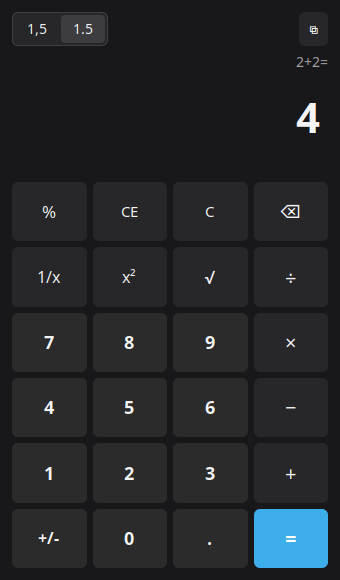

# Calc

A Windows 11-style desktop calculator written in pure Go and drawn natively
with [MyGo](https://mygo.egoist.dev/docs) — no HTML, no JavaScript, no webview.




## Install

### Linux

One command, no root needed:

```sh
curl -fsSL https://raw.githubusercontent.com/CBR0/calc/main/install.sh | sh
```

It installs the app in `~/.local/calc.app`, the `calc` command in
`~/.local/bin` and an entry in the applications menu. Run the same command
again to update to the latest release, or `sh install.sh --uninstall` to
remove it.

Prefer to do it by hand? Download `calc-<version>-linux-amd64.tar.gz` (or
`arm64`) from [Releases](https://github.com/CBR0/calc/releases), unpack it
and run its `install.sh`. A `.deb` is published too.

### Windows

Download from [Releases](https://github.com/CBR0/calc/releases):

- `Calc Setup <version>.exe` — installer for the current user (no admin), or
- `Calc.exe` — the standalone app, no install needed.

> The binaries are not code-signed, so SmartScreen may warn on first run.

## Features

- Windows 11 Calculator layout and behavior
- Expression entry: type `2+2` and the text appears literally; it computes on
  `Enter`/`=`, showing `2+2=` on top and `4` below
- Immediate (left-to-right) evaluation, like Windows Standard, plus `%`,
  `x²`, `√`, `1/x`, `+/-`, `CE`, `C` and `⌫`
- `=` repeats the last operation
- The display is a real text field: select, copy (`Ctrl+C`), paste (`Ctrl+V`)
  and type directly into it; pasted numbers in either format are accepted
  (`247.227915`, `6,306.04879`)
- Thousands grouping in the display and in the history, as in Windows
- Decimal separator switch in the toolbar: `1.5` (US, default) or `1,5`
  (BR); the decimal key and the results follow it
- Physical keyboard works by character, so any layout works (ABNT2, US,
  numeric): `0-9`, `.`/`,`, `+ - * / % =`, `Enter` (=), `Backspace`/`Delete`,
  `Esc` (C), `Ctrl+N` (new window)
- Light/dark theme follows the system
- Several windows: no single-instance lock — every launcher click opens a new
  process and window; inside the app, `Ctrl+N` opens another window in the
  same process

## Development

Needs Go 1.27 or newer.

```sh
go tool mygo dev      # run with live reload
go test ./...         # engine and UI tests
```

## Building

```sh
go tool mygo build -platform linux/amd64
go tool mygo build -platform windows/amd64
```

Artifacts land in `build/<os>-<arch>/`: on Linux the executable, a Debian
package and a tarball with `install.sh`; on Windows the `.exe` and a zip. The
Windows installer (`Calc Setup <version>.exe`) is only made when NSIS
(`makensis`) is available.

## Releases

Pushing a tag `vX.Y.Z` runs
[.github/workflows/release.yml](.github/workflows/release.yml), which builds
Linux (amd64/arm64) and Windows (amd64) and uploads the artifacts to a
draft release. Review the draft and publish it: the one-line installer fetches
the latest published release through the GitHub API.

## Project layout

- `main.go` — MyGo window and native UI view (Windows layout; the display is
  a one-line `TextAreaBase` with fixed focus, so the keyboard goes through
  its text; `Esc` clears, `Ctrl+N` opens a window)
- `calc.go` — calculator engine (Windows style: chaining, `%`, `1/x`, `x²`,
  `√`, `=` repetition) plus `UserEdit`/`filterEntry`, which sanitize
  typing/pasting into the display and turn a trailing operator into an
  operation
- `main_test.go` — engine tests and view tests with `ui.NewTester`
- `install.sh` — public one-command installer for Linux
- `mygo.json` — app name, identifier, version, resources and update settings
- `resources/icon.png` — 1024×1024 icon

## License

[MIT](LICENSE)
